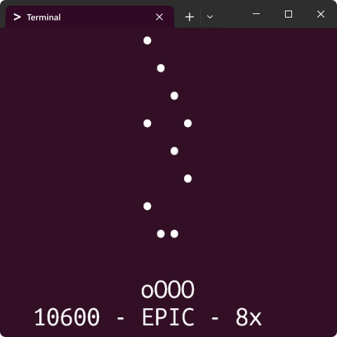

# Goofy ahh PHP rhythm game

A little rhythm game written in PHP that runs in the terminal.

Theres's no actual music so you'll have to imagine the "rhythm" part youself lol.

This is a silly side project, not a serious engine or anything.

It handles window resizing, can take any number of note lanes and you can load your own charts.

## 🎮 How 2 run it

You need PHP installed and available in your terminal.

Open the project folder in your terminal and run:

```
php main.php
```

### Where it does and does not run

This project uses `stty` and raw terminal mode shenanigans for input + screen drawing. Input/rendering will be weird or just fail if your terminal doesn't have it.

- It works on terminals that support Unix-style `stty` behavior like Linux & Mac.
- It usually shits the bed in plain Windows PowerShell/cmd so you might have to install WSL or something.

## ⚙ Settings explained

There's a `settings.json` file where you can change some settings:
- `keybinds`: keys that have to be pressed to hit the notes, can be any number of keys
- `scrollSpeed`: amount of time in ms between each row of characters, this does not change the timing of the notes, only approach speed (space between notes)
- `countdown`: time in ms to wait before the game starts
- `strumLinePosition`: position of the play field as a percentage of the window width (`0.5` = middle)
- `advancedNoteDisplay`: whether to use braille characters for more precise note display, which allows notes to be at different positions within the same line

## 🎵 Charting

`chart.json` is where the notes are loaded from.

Each note is basically:

```json
{ "position": 1234, "lane": 0 }
```

- `position`: after how long the note should reach the judgement line in ms.
- `lane`: the index of the lane. You can actually have as many lanes as you want, but the game will only render the amount of lanes as there are keybinds.

There's a script in `scripts/FNF-to-PHP.py` that can convert Friday Night Funkin' JSON charts into this format, just put the chart you want to convert in `scripts/input_chart.json` and run the script. 

You can also just make your own `chart.json` if you want to but uhm have fun doing that by hand lmao.

## 💠 Other shi

This was originally a school project to make a PHP terminal game, but I got a little carried away as always.

Code is whatever, do you want with it, I don't care.

Contributions are open if you feel like it, I'd love to see them, but know this project probably isn't going anywhere and is mostly just for fun.
